# Connex AGI - Three-Tier Agentic Planning System

> **Building the base of AGI**: A system where every user interaction is converted into a structured sequence of executable actions.

Connex AGI implements a sophisticated three-tier architecture that transforms nebulous goals into executable "programs" — making it a compiler for human intent.

## 🎯 Architecture Overview

Connex AGI mimics biological cognitive systems by integrating **Deliberative Reasoning** (Planner/Orchestrator) with **Perception** (Senses), **Reflexes** (Automatic Responses), **Motivation** (Self-Evaluation), and **Memory** (Knowledge/Experience).

```mermaid
graph TD
    %% Define Nodes with Icons
    User(["👤 User Intent"])
    
    subgraph Senses["👁️ TIER PEER (SENSES & REACTIONS)"]
        Perception(["👁️ Perception Layer"])
        Reflex(["⚡ Reflex Layer"])
    end
    
    subgraph Accelerator["🚀 TIER 8 (PARALLEL ENGINE)"]
        SubBrain{{"🧠 Sub-Brain System<br/>(Local SmolLM)"}}
    end
    
    subgraph Core["🧠 CORE BRAIN (REASONING)"]
        Planner[["🏗️ Tier 1: Planner"]]
        Orchestrator[["⚙️ Tier 2: Orchestrator"]]
    end
    
    subgraph Workers["🛠️ TIER 3 (EXECUTION)"]
        SkillDock["🔧 SkillDock / Workers"]
    end
    
    subgraph Evolution["🌱 TIER 4 (SELF-EVOLUTION)"]
        Motivation["📈 Motivation System"]
        Memory["💾 Memory System"]
    end

    %% Flow Connections
    User -->|Goal| Perception
    User -->|Trigger| Reflex
    
    Perception <-->|Fast Data| SubBrain
    Orchestrator <-->|Offload| SubBrain

    Perception -->|Context| Planner
    Reflex -->|Automated Plan| Orchestrator
    
    Planner -->|Action DAG| Orchestrator
    Orchestrator -->|Skill Call| SkillDock
    SkillDock -->|Result| Orchestrator
    
    Orchestrator -->|Trace| Motivation
    Orchestrator -->|History| Memory
    Motivation -.->|Learn| Planner
    Memory -.->|Recall| Planner

    %% Professional Styling
    style User fill:#fff,stroke:#333,stroke-width:2px
    style Perception fill:#e0f7fa,stroke:#00acc1,stroke-width:2px
    style Reflex fill:#ffebee,stroke:#e53935,stroke-width:2px
    style SubBrain fill:#f3e5f5,stroke:#8e24aa,stroke-width:3px,color:#4a148c
    style Planner fill:#e8eaf6,stroke:#3949ab,stroke-width:2px
    style Orchestrator fill:#e8f5e9,stroke:#43a047,stroke-width:2px
    style SkillDock fill:#f1f8e9,stroke:#7cb342,stroke-width:2px
    style Motivation fill:#fff3e0,stroke:#fb8c00,stroke-width:2px
    style Memory fill:#fff8e1,stroke:#ffb300,stroke-width:2px

    %% Subgraph Styling
    style Senses fill:transparent,stroke:#999,stroke-dasharray: 5 5
    style Core fill:transparent,stroke:#999,stroke-dasharray: 5 5
    style Evolution fill:transparent,stroke:#999,stroke-dasharray: 5 5
    style Workers fill:transparent,stroke:#999,stroke-dasharray: 5 5
```




For a detailed technical breakdown of the 8-tier system, see **[ARCHITECTURE.md](docs/ARCHITECTURE.md)**.


### 1. Perception Layer (Senses) 👁️
**"The Eyes and Ears of the AGI"**

The Perception Layer connects the AGI to the real world using the **Model Context Protocol (MCP)**.
- **Purpose**: Gathers real-time environmental data *before* or *during* planning.
- **Mechanism**: Connects to external sensors, databases, or live feeds.
- **Integration**: The Brain checks if it needs "eyes" (Perception) to understand the user's request accurately.
- **Examples**: 
    - Reading live logs
    - Checking server status
    - Analyzing a video stream

### 2. Reflex Layer (Unconditional Reflex) ⚡
**"The Nervous System"**

Reflexes are pre-programmed, automatic responses to specific triggers. They bypass the slow, expensive reasoning of the Planner for known, critical events.
- **Purpose**: Instant reaction to external signals (Webhooks, Signals).
- **Mechanism**: Event Listener -> Condition Check -> Static/Dynamic Plan.
- **Integration**: Feeds executable plans directly to the Orchestrator.
- **Example**: 
    - *Trigger*: `github_webhook` (Push Event)
    - *Reflex Plan*: `[git_pull, run_tests, notify_slack]`

### 3. Tier 1: The Planner (Architect) 🧠
The high-reasoning component that decomposes goals into action sequences.
- **Model**: DeepSeek-R1, GPT-o1, or Claude
- **Input**: Natural language goal + Perception Context + Memory Recall
- **Output**: Directed Acyclic Graph (DAG) of actions
- **Logic**: Chain-of-thought reasoning to identify inputs/outputs

### 4. Tier 2: The Orchestrator (Manager) ⚙️
The state management and routing layer.
- **State Management**: Tracks completed, pending, and failed actions
- **Input/Output Mapping**: Ensures outputs from Step A become inputs for Step B
- **Self-Correction**: Re-plans if a step fails

### 5. Tier 3: The SkillDock (Workers) 🔧
Modular skills that perform actual work.
- **Built-in Skills**: Web search, HTTP client, code execution
- **Custom Skills**: Easy to create and install from Registry

### 6. Motivation System (Self-Improvement) 📈
The reflective layer that monitors performance and triggers learning.
- **Log Review**: Analyzes execution logs to identify failures or bottlenecks.
- **Self-Evaluation**: Uses the Brain to assess if goals were met efficiently.
- **Skill Acquisition**: Autonomously generates and installs new skills to bridge capability gaps.

### 7. Memory System (Experience) 🧠
The persistent knowledge storage that enables long-term learning.
- **Short-Term**: RAM-based cache for immediate dialogue context.
- **Long-Term**: SQLite vector storage for semantic retrieval of past interactions.
- **Process**: Daily summarization of logs into high-level "Experience Notes".

### 8. World Layer (World Cognition) 🌍
**"The AGI's Theory of Physics"**

The World Layer provides a prompt-free, neural-network-based model of world dynamics, anchored by real-time perception.
- **Latent Metaphysical Core**: A PyTorch MLP that predicts state transitions $(S, A) \to S'$.
- **Reality Grounding**: Continuously anchored by the **Perception Layer**. When sensors (like `system_monitor`) measure real-time data, they "push" updates to the world model to ensure simulation matches reality.
- **Epistemic Layer**: Interprets objective world data into subjective "feelings" or insights.

### 9. Sub-Brain System (Local Acceleration) 🚀
A parallel processing infrastructure for offloading auxiliary cognitive tasks to local LLMs.
- **Purpose**: Fast, privacy-preserving execution of sub-tasks like emotion detection or intent classification.
- **Architecture**: `SubBrainManager` coordinates multiple `SubBrainHost` instances.
- **SmolLM Integration**: Uses `SmolLM-135M-Instruct` with 4-bit quantization for ultra-fast local inference.
- **Cloud Fallback**: Automatically falls back to primary brain (Cloud) if local services are unavailable.

---

## 🚀 Quick Start

### 1. Installation

```bash
cd connex/agi
pip install -e .
```

### 2. Configuration

Copy the environment template and add your API keys:

```bash
cp .env.example .env
# Edit .env and add your keys
```

### 3. Basic Usage (Python)

```python
from agi import AGI
import asyncio

async def main():
    agi = AGI()
    await agi.initialize()
    
    # Standard Goal Execution
    result = await agi.execute(
        goal="Check the server logs and summarize the last error",
        context={"server_id": "prod-1"}
    )
    
    # Perception Query (Direct)
    data = await agi.perception.perceive("server_logs_mcp", query="last 5 mins")
```

### 4. API Usage (Server)

Start the server:
```bash
python server.py
```

**Trigger a Reflex (Webhook):**
```bash
curl -X POST http://localhost:8001/api/reflex/webhook/github \
     -H "Content-Type: application/json" \
     -d '{"event": "push", "repo": "connex"}'
```

---


## 📜 The Constitution (The Soul)

Connex AGI is governed by a **Constitution** (`agi/SOUL.md`) that enforces ethical boundaries and safe operations.

**Principles in the Soul:**
1.  **Beneficence & Non-Maleficence**: Do good, do no harm.
2.  **Verification**: High-risk actions require confirmation.
3.  **Transparency**: No hallucinations; explicit warnings for risks.

The Brain reads this constitution **dynamically** before every reasoning step, ensuring that the Plan aligns with these core values.

---

## 🧠 Memory System (Knowledge & Experience)

Connex AGI features a dual-tier memory system to ensure both immediate context awareness and long-term learning.

### 1. Short-Term Memory (The Cache)
- **Volatile**: Resides in RAM, active during the session.
- **Goal**: Provides immediate context for the current conversation.
- **Capacity**: Stores the last 10 interactions to maintain dialogue flow.

### 2. Long-Term Memory (The Archive)
- **Persistent**: SQLite-backed vector storage (`agi_memory.db`).
- **Semantic Similarity**: Uses cosine similarity to find **top-match memories** even without explicit date filters, allowing the AGI to recall related context from any point in its history.
- **Daily Summarization**: A specialized process that rolls up the day's history into high-level "Experience Notes" to save space and enhance recall accuracy.

### 3. Recall Skill
The AGI uses the `memory_recall` skill to "remember" past interactions when planning complex goals.

---

## 🚀 Motivation System (Self-Improvement)

The Motivation System allows the AGI to "feel" its own limitations and proactively fix them.

- **How it works**: After every task, the AGI reviews its own execution logs.
- **Evaluator**: Assesses quality and determines if a failure was due to a missing capability.
- **Skill Acquisition**: If a gap is found, the AGI triggers a meta-plan to build a new skill using the `skill_acquisition` tool, which leverages the `skill_creator`.

---

## 📚 Core Concepts

### Hub Interface
Both Perception and Reflex modules are treated as **installable capabilities**, similar to Skills.
- **Perception Hub**: Install new sensors/data sources.
- **Reflex Hub**: Install new automation recipes.

### The Brain's Inner Monologue
With Perception integrated, the AGI's thought process evolves:

1. **Core Objective**: What does the user want?
2. **Perception Check**: Do I need to "see" something first? (e.g. Query MCP)
3. **Capability Check**: Which skills do I have?
4. **Strategic Plan**: Build the Action DAG.
5. **Motivation Check (Post-Task)**: Did I perform well? Do I need to learn a new skill?

## 🛠️ Extensibility

### Creating a Perception Module

```python
from agi.perception import PerceptionModule

class MySensor(PerceptionModule):
    @property
    def perception_type(self):
        return "visual"

    async def perceive(self, query=None, **kwargs):
        # Connect to MCP or Hardware
        return {"temperature": 72, "status": "nominal"}
```

### Creating a Reflex

```python
from agi.reflex import ReflexModule

class DeployReflex(ReflexModule):
    async def evaluate(self, event):
        return event.get("type") == "release_published"
        
    async def get_plan(self):
        return [
            {"skill": "ssh_client", "args": {"cmd": "deploy.sh"}},
            {"skill": "email", "args": {"to": "admin", "body": "Deployed!"}}
        ]
```

## 📜 License
MIT License - Part of the Connex Platform
