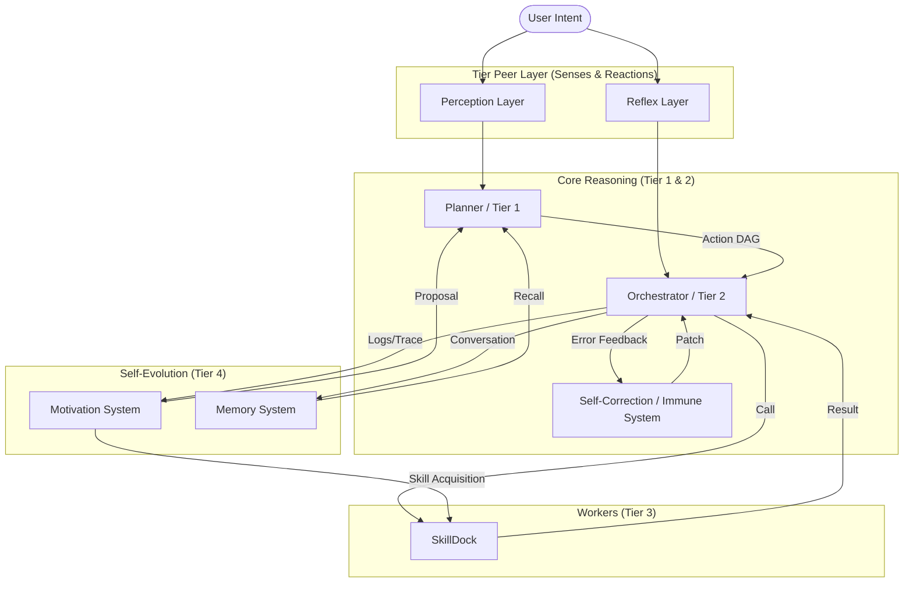

# Connex AGI Technical Architecture

This document provides a deep dive into the 7-tier architecture of Connex AGI.

## High-Level Cognitive Architecture

Connex AGI is designed to mimic a biological brain, separating fast reactions from deep reasoning and ensuring long-term self-improvement.

## Layer Descriptions

### 1. Perception Layer (Tier Peer)
- **Role**: Senses.
- **Mechanism**: Connects to the environment via MCP or specific sensors.
- **Foundational Modules**: 
    - `WorkloadPerception` (Telemetry)
    - `IntentDriftPerception` (Goal monitoring)
    - `VoicePerception` (Listening)
    - `CapabilityPerception` (Self-Awareness/Skill Registry)

### 2. Reflex Layer (Tier Peer)
- **Role**: Immediate Reaction.
- **Mechanism**: Listeners triggered by webhooks or signals.
- **Foundational Modules**: 
    - `SafetyPolicyReflex` (Compliance)
    - `ResourceGovernorReflex` (Throttling)
    - `VoiceCommandReflex` (Spoken Orders)
    - `SelfRepairReflex` (Error Recovery)
- **Function**: Bypasses the Planner for known automation recipes.

### 3. Planner (Tier 1)
- **Role**: The Architect.
- **Model**: High-reasoning LLMs.
- **Function**: Decomposes goals into structured **Action DAGs**. It considers both Perception context and Memory recall.

### 4. Orchestrator (Tier 2)
- **Role**: The Manager.
- **Function**: Executes the Action DAG, manages state, and handles I/O mapping between steps.
- **Corrector**: When an action fails, the Orchestrator uses the Corrector to generate immediate fixes.

### 5. SkillDock (Tier 3)
- **Role**: The Workers.
- **Function**: A registry of modular tools (Python classes) that perform specific tasks.

### 6. Motivation System (New)
- **Role**: Self-Reflection & Evaluation.
- **Mechanism**: Reads logs/traces post-execution.
- **Function**: Reviews performance quality and triggers **Skill Acquisition** to improve the AGI's future power.

### 7. Memory System
- **Role**: Experience Storage.
- **Mechanism**: SQLite-backed Vector DB.
- **Function**: Provides semantic recall of past interactions and daily experience summarization.
