# Connex AGI Technical Architecture

This document provides a deep dive into the 8-tier architecture of Connex AGI.

## High-Level Cognitive Architecture

Connex AGI is designed to mimic a biological brain, separating fast reactions from deep reasoning and ensuring long-term self-improvement.

```mermaid
graph TD
    %% Define Nodes with Icons
    User(["👤 User Intent"])
    
    subgraph Senses["👁️ TIER PEER (SENSES & REACTIONS)"]
        Perception(["👁️ Perception Layer"])
        Reflex(["⚡ Reflex Layer"])
    end
    
    subgraph Accelerator["🚀 TIER 8 (PARALLEL ENGINE)"]
        SubBrain{{"🧠 Sub-Brain System<br/>(Local SmolLM)"}}
    end
    
    subgraph Core["🧠 CORE BRAIN (REASONING)"]
        Planner[["🏗️ Tier 1: Planner"]]
        Orchestrator[["⚙️ Tier 2: Orchestrator"]]
    end

    subgraph World["🌍 TIER 5 (WORLD COGNITION)"]
        WorldLayer[["🌍 World Layer / Causality"]]
    end
    
    subgraph Workers["🛠️ TIER 3 (EXECUTION)"]
        SkillDock["🔧 SkillDock / Workers"]
    end
    
    subgraph Evolution["🌱 TIER 4 (SELF-EVOLUTION)"]
        Motivation["📈 Motivation System"]
        Memory["💾 Tier 6: Memory System"]
    end

    subgraph Community["🌐 TIER 10 (HIVE MIND)"]
        Registry{{"Remote Registry"}}
    end

    %% Flow Connections
    User -->|Goal| Perception
    User -->|Trigger| Reflex
    
    Perception <-->|Fast Data| SubBrain
    Orchestrator <-->|Offload| SubBrain

    Perception -->|Context| Planner
    Reflex -->|Automated Plan| Orchestrator

    Perception -.->|Grounding| WorldLayer
    
    Planner -->|Action DAG| Orchestrator
    Orchestrator <-->|Causality Check| WorldLayer
    Orchestrator -->|Skill Call| SkillDock
    SkillDock -->|Result| Orchestrator
    
    Orchestrator -->|Trace| Motivation
    Orchestrator -->|History| Memory
    Motivation -.->|Learn| Planner
    Memory -.->|Recall| Planner

    %% Registry Connections
    Registry <-->|Install| SkillDock
    Registry <-->|Install| Perception
    Registry <-->|Install| Reflex
    Motivation -.->|Discover| Registry

    %% Professional Styling
    style User fill:#fff,stroke:#333,stroke-width:2px
    style Perception fill:#e0f7fa,stroke:#00acc1,stroke-width:2px
    style Reflex fill:#ffebee,stroke:#e53935,stroke-width:2px
    style SubBrain fill:#f3e5f5,stroke:#8e24aa,stroke-width:3px,color:#4a148c
    style Planner fill:#e8eaf6,stroke:#3949ab,stroke-width:2px
    style Orchestrator fill:#e8f5e9,stroke:#43a047,stroke-width:2px
    style WorldLayer fill:#fff8e1,stroke:#fbc02d,stroke-width:2px
    style SkillDock fill:#f1f8e9,stroke:#7cb342,stroke-width:2px
    style Motivation fill:#fff3e0,stroke:#fb8c00,stroke-width:2px
    style Memory fill:#fff8e1,stroke:#ffb300,stroke-width:2px
    style Registry fill:#e1f5fe,stroke:#0288d1,stroke-width:2px,stroke-dasharray: 5 5

    %% Subgraph Styling
    style Senses fill:transparent,stroke:#999,stroke-dasharray: 5 5
    style Core fill:transparent,stroke:#999,stroke-dasharray: 5 5
    style Evolution fill:transparent,stroke:#999,stroke-dasharray: 5 5
    style Workers fill:transparent,stroke:#999,stroke-dasharray: 5 5
    style Community fill:transparent,stroke:#999,stroke-dasharray: 5 5
```

## Layer Descriptions

### 1. Perception Layer (Tier Peer)
- **Role**: Senses.
- **Mechanism**: Connects to the environment via MCP or specific sensors.
- **Foundational Modules**: 
    - `WorkloadPerception` (Telemetry)
    - `IntentDriftPerception` (Goal monitoring)
    - `VoicePerception` (Listening)
    - `CapabilityPerception` (Self-Awareness/Skill Registry)

### 2. Reflex Layer (Tier Peer)
- **Role**: Immediate Reaction.
- **Mechanism**: Listeners triggered by webhooks or signals.
- **Foundational Modules**: 
    - `SafetyPolicyReflex` (Compliance)
    - `ResourceGovernorReflex` (Throttling)
    - `VoiceCommandReflex` (Spoken Orders)
    - `SelfRepairReflex` (Error Recovery)
- **Function**: Bypasses the Planner for known automation recipes.

### 3. Planner (Tier 1)
- **Role**: The Architect.
- **Model**: High-reasoning LLMs.
- **Function**: Decomposes goals into structured **Action DAGs**. It considers both Perception context and Memory recall.

### 4. Orchestrator (Tier 2)
- **Role**: The Manager.
- **Function**: Executes the Action DAG, manages state, and handles I/O mapping between steps.
- **Corrector**: When an action fails, the Orchestrator uses the Corrector to generate immediate fixes.

### 5. SkillDock (Tier 3)
- **Role**: The Workers.
- **Function**: A registry of modular tools (Python classes) that perform specific tasks.

### 6. Motivation System (New)
- **Role**: Self-Reflection & Evaluation.
- **Mechanism**: Reads logs/traces post-execution.
- **Function**: Reviews performance quality and triggers **Skill Acquisition** to improve the AGI's future power.

### 7. World Layer (Tier 5)
- **Role**: World Physics & Reality Anchor.
- **Mechanism**: Prompt-free neural transition model (PyTorch MLP), grounded via **Perception pushing**.
- **Function**: Predicts action consequences while being continuously synchronized with real-time MCP sensor data (Storage, Health, Energy).
- **Communication**: Receives grounding signals from Perception and provides transition predictions to the Orchestrator.

### 8. Memory System
- **Role**: Experience Storage.
- **Mechanism**: SQLite-backed Vector DB.
- **Function**: Provides semantic recall of past interactions and daily experience summarization.

### 9. Sub-Brain System (Tier 8)
- **Role**: Local Acceleration & Parallelization.
- **Mechanism**: Distributed local LLM hosts (e.g., SmolLM-135M-Instruct).
- **Function**: Offloads intensive but straightforward tasks like emotion detection, formatting, or intent classification from the main Brain, allowing for faster response times and improved privacy.

### 10. The Connex Registry (Tier 10)
- **Role**: The Hive Mind / Collective Knowledge.
- **Mechanism**: A centralized, remote repository of Skills, Perceptions, and Reflexes.
- **Function**:
    - **Discovery**: Enables AGIs to find new capabilities they lack.
    - **Federated Learning**: Aggregates successful skills and patterns from thousands of AGIs.
    - **Auto-Recovery**: Provides a fallback source for missing dependencies or failed plans.
- **Interconnectivity**: Allows this AGI to connect with other AGI servers to form a distributed intelligence network.
